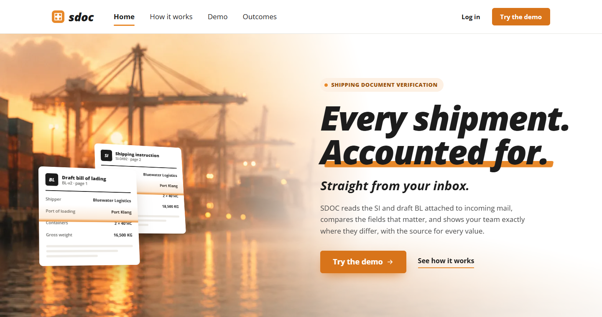
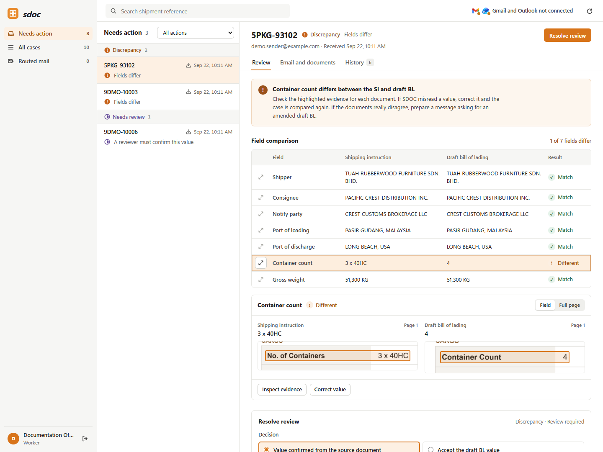
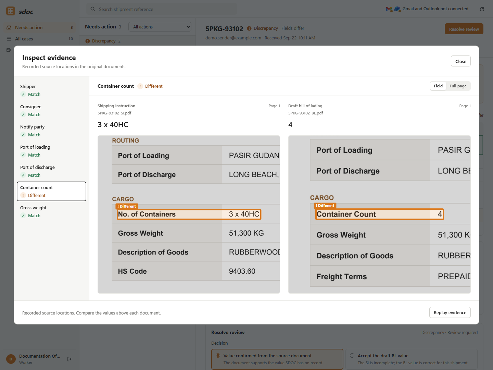
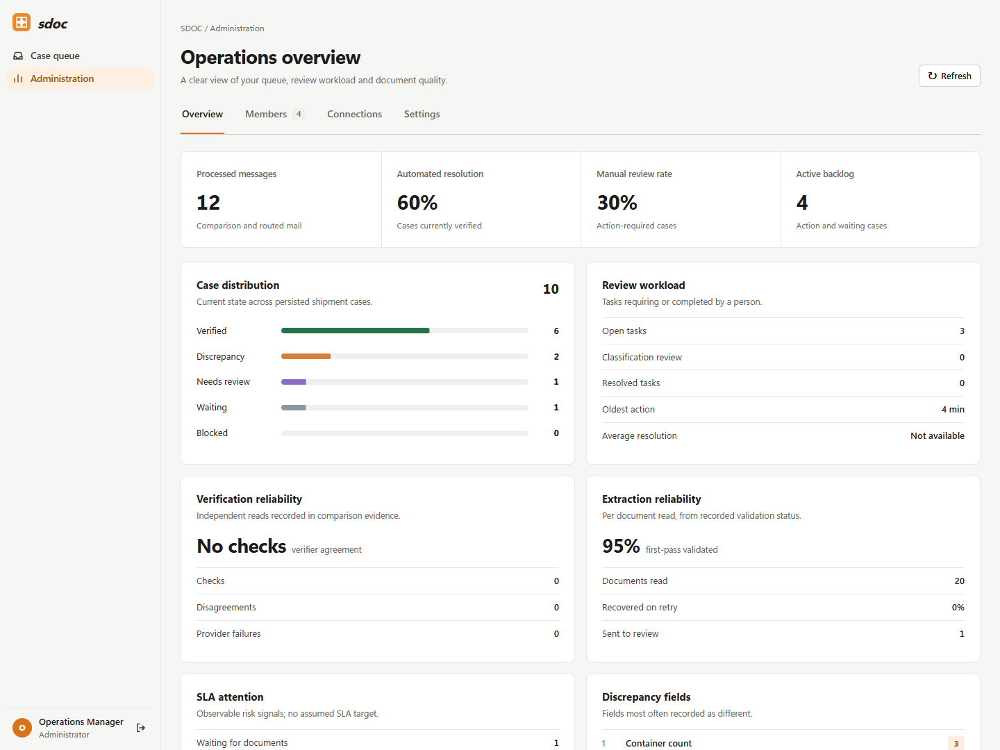
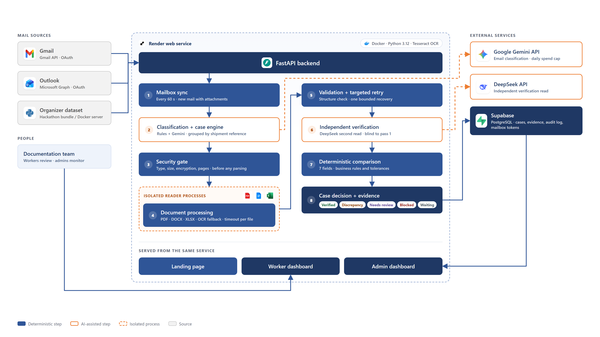

# SDOC — Shipping Document Verification

**Every shipment. Accounted for.**

SDOC reads a shipping-operations inbox, finds the emails that ask for a
Shipping Instruction (SI) to be checked against a draft Bill of Lading (BL),
compares the seven fields that matter, and shows the documentation team exactly
where the two documents disagree, with the printed source for every value.
When SDOC is not sure, a person decides. It never guesses.

| | |
|---|---|
| **Live prototype** | https://sdoc-jy2x.onrender.com/ |
| **Demo video** | [Watch on Google Drive](https://drive.google.com/file/d/1ZHcjKpmWUgQOxHftUEhn95mE2_d7MBge/view?usp=sharing) |
| **Slide deck** | [View on Google Slides](https://docs.google.com/presentation/d/18aPZarvIStehdZuAuIcNmV7ENdi3UTrAB1uQr3v7kEE/edit?usp=sharing) |

> The prototype runs on Render's free plan and sleeps when idle. The first
> request can take up to a minute while the service wakes.



---

## What it does

1. **Connects to Gmail and Outlook.** Both can be connected at once, with read-only OAuth.
2. **Classifies each email.** The categories are `BL_COMPARISON`, `SI_REQUEST`,
   `INVOICE_QUERY`, `GENERAL` and `SPAM`. Only comparison requests go on to
   document checks. The rest are routed.
3. **Groups mail into shipment cases** by shipment reference, so a corrected BL
   sent two days later joins the case it belongs to.
4. **Extracts and compares seven fields:** shipper, consignee, notify party,
   port of loading, port of discharge, container count and gross weight.
   Fields are aligned by meaning, not by header text ("Load Port" ≡ "Port of Loading").
5. **Decides the case** as `VERIFIED`, `DISCREPANCY`, `NEEDS_REVIEW`,
   `WAITING` or `BLOCKED`, and records the evidence behind the decision.
6. **Puts the evidence on screen.** A reviewer sees both documents cropped to
   the exact position of the value, corrects a misread in one step, and gets a
   drafted reply asking the shipper for an amended BL. Nothing is sent
   automatically.

### Screenshots

**Case review.** The field table shows the one field that differs. The pane
below crops both source documents to where each value was printed.



**Inspect evidence.** The full evidence view for the mismatched field, with
the SI saying `3 x 40HC` and the draft BL saying `4`, each boxed on its own page.



**Operations overview.** The admin view of case distribution, review workload
and extraction reliability.



---

## Technical Architecture



The whole product is **one FastAPI service** in one Docker container on Render.
It serves the API, the landing page, the worker workspace and the admin
dashboard. Supabase (PostgreSQL) holds cases, evidence, the audit log and
mailbox tokens, so the service keeps no state on its own disk.

Each email goes through these stages:

| # | Stage | Kind | What happens |
|---|---|---|---|
| 1 | Mailbox intake | Deterministic + provider signals | Every 60 s, fetch new emails and attachments from connected mailboxes; capture sender, subject, body, attachment metadata, spam labels and authentication signals |
| 2 | Email classification | Hybrid AI + rules | Deterministic rules handle obvious cases; Gemini classifies ambiguous emails into BL comparison, SI request, invoice query, general or spam |
| 3 | Shipment case engine | Deterministic | Group related emails and document versions under the same shipment case so context accumulates over time |
| 4 | Security & resource gate | Deterministic | Check real file type, size, encryption, page count, malformed files and archive expansion **before document parsing or AI processing** |
| 5 | Document reading | Hybrid, isolated | Machine-readable PDF/DOCX/XLSX/text use local readers; scans use OCR/VLM fallback; parsing runs in helper processes with per-file timeout |
| 6 | AI extraction | AI-assisted | Gemini interprets document structure and extracts the 7 canonical shipping fields into a fixed schema |
| 7 | Deterministic validation + targeted retry | Hybrid recovery | Rules verify required fields, datatype, units and parseability; known failures trigger **one targeted AI/OCR recovery attempt** |
| 8 | Independent AI verification | Dual-model AI | DeepSeek independently re-reads the source without seeing Gemini’s answer and cross-checks the extracted values; disagreement → Needs Review |
| 9 | SI ↔ BL comparison | Deterministic | Field-specific rules compare verified values using normalization, unit conversion, port handling and numeric equality |
| 10 | Case decision + evidence | Deterministic | Assign Verified, Discrepancy, Needs Review or Blocked; save reason, source evidence, retry trace and audit history to Supabase |

The design follows one principle: **the model reads, the rules decide.**
AI is used to classify mail and to read documents. The comparison, the
tolerances and the final case state are all plain code, so every decision
can be reproduced and explained.

### Stack

| Layer | Technology |
|---|---|
| Backend | Python 3.12, FastAPI, Uvicorn |
| Document reading | pdfplumber, pypdfium2, python-docx, openpyxl, Tesseract OCR |
| AI | Google Gemini (classification); DeepSeek (independent verifier, integration in progress) |
| Mail | Gmail API, Microsoft Graph, OAuth 2.0 |
| Storage | Supabase (PostgreSQL, RPC functions, row-level security); SQLite locally |
| Front end | Plain HTML, CSS and JavaScript, served by the same service |
| Hosting | Docker on Render |

### Repository layout

```
backend/              Python backend
  sdoc/               the application package (see table below)
  supabase/migrations SQL schema and RPC functions
  tests/              pytest suite
  scripts/            ingestion, demo-data and demo-kit generators
sdoc-app/             worker workspace and admin dashboard (static)
sdoc-landing/         public landing page (static)
docs/                 architecture diagram, screenshots, planning/ (proposal, add-ons, brief)
demo-live/            scripted live-demo scenarios (emails + PDFs)
Dockerfile, render.yaml
```

---

## Implementation Details

### Backend modules (`backend/sdoc/`)

| Module | Responsibility |
|---|---|
| `api.py` | FastAPI app: case, review, correction, mailbox and attachment endpoints; serves the front ends |
| `gmail.py`, `outlook.py`, `mailbox.py` | Mail providers, OAuth flows, a registry so both run side by side |
| `classify.py` | Email category rules, with a Gemini classifier for ambiguous mail |
| `casework.py`, `supabase_store.py` | Shipment cases, document versions, review tasks, audit events; same interface for SQLite and Supabase |
| `preflight.py`, `budget.py` | Security gate before parsing; per-sender and global daily spend ceilings |
| `readers.py`, `reader_pool.py` | Per-format readers that emit values *with provenance*, run in helper processes |
| `schema.py`, `docs.py` | Canonical seven-field schema, label synonyms (English, Chinese, French, German, Spanish, Bahasa), normalisation |
| `validation.py` | Structural validation and the single bounded recovery cycle |
| `verification.py` | Blind second-pass reader and agreement gate |
| `compare.py` | Field-by-field comparison with per-field evidence |
| `drafting.py` | Correction, missing-document and confirmation drafts (never sent) |
| `analytics.py` | Admin metrics: resolution rates, backlog, first-pass and recovery rates |
| `auth.py` | Username/password accounts, worker and admin roles |
| `runtime_state.py` | Mailbox tokens, sync cursors and spend ledger in Supabase on disposable hosts |

### Source evidence for every value

Every reader returns each value together with where it came from:

| Format | Provenance recorded |
|---|---|
| PDF | page, bounding box in PDF points, page size, text snippet |
| Text, OCR | page, line, snippet |
| DOCX, XLSX | table or sheet, row, snippet |

The API renders a PDF page to PNG at a known scale, and the evidence pane
places the box as a share of the page. That is how the crops in the
screenshots land exactly on the printed value. When a value is missing and
there is nothing to box, the pane shows the whole page, so the reviewer can
confirm the absence for themselves.

When the LLM extraction stage is selected, the model reports only the
*snippet* it read. The snippet is then matched against the deterministic
transcription to recover page, line and box. The model never reports a
position itself.

### Two independent reads

The verifier is designed to be a different model from the extractor, so the
two reads don't share the same blind spots. DeepSeek is the intended
verifier. Its integration is not finished yet, and until it is, Gemini runs
the second pass behind the same interface (`sdoc/verification.py`).

Pass 2 reads the original document without seeing Pass 1's answer. Both
results are normalised with the same rules. If they disagree, the case
becomes `NEEDS_REVIEW / verifier_disagreement`. If the verifier fails, the
case becomes `NEEDS_REVIEW / verifier_failed`, never a silent pass.

### Human in the loop

- **Correct value.** A reviewer replaces a misread value. The original is kept,
  and the case is re-compared with the same rules as the automated path.
  SQLite and Supabase share one `apply_correction`, so the two stores cannot drift.
- **Resolve review.** A reviewer records a decision (value confirmed from the
  source, or draft BL value accepted), which closes the review task and is
  written to the audit log.
- **Drafts.** SDOC prepares the email asking for an amended BL, but a person sends it.

### Security controls

- The preflight gate runs its checks in order of cost: byte length, then magic
  bytes, then structure. Parsing is itself the attack surface, so nothing is
  parsed until the cheaper checks pass. A gated attachment becomes `BLOCKED` and
  never reaches a reader.
- Daily spend ceilings per sender and across all senders are persisted, so a
  restart does not reset an attacker's allowance.
- Attachment filenames are sanitised on write and contained on read (path traversal fixed).
- Passwords are PBKDF2 hashes. Sessions are HMAC-signed HttpOnly cookies.
- Supabase uses row-level security with no browser policies. RPC functions are
  granted only to `service_role`, and the secret key never reaches the browser.

### Results

- **Organizer dataset (520 emails):** final score **1.0000**. That is 100%
  classification macro-F1, 46/46 defects caught, and 20/20 review cases
  escalated with no false escalations. After every change, the output was
  checked to be byte-identical to the recorded baseline.
- **Test suite:** 182 tests passing (`python -m pytest -q`).

### Run it locally

```powershell
cd backend
pip install -r requirements.txt
copy ..\.env.example ..\.env        # then fill in keys; see comments inside
python scripts/ingest_source.py demo-data --ocr   # load demo cases
python run_api.py
```

| URL | What |
|---|---|
| http://127.0.0.1:8001/ | Landing page |
| http://127.0.0.1:8001/app/ | Worker workspace |
| http://127.0.0.1:8001/app/admin.html | Admin dashboard |
| http://127.0.0.1:8001/docs | OpenAPI documentation |

Local seeded accounts are `worker` / `worker123` and `admin` / `admin123`,
both overridable with `SDOC_WORKER_PASSWORD` and `SDOC_ADMIN_PASSWORD`.
For the pipeline CLI, config options and the full API table, see
[backend/README.md](backend/README.md).

---

## Challenges Faced

### 1. Connecting Gmail and Outlook

The mail connection took more work than any other part of the build. The
two providers look similar, but they fail in different ways.

- **Two providers at once.** Storing tokens was never the problem, because
  each provider already kept its own token file. The problem was routing: one
  global "provider" setting and one service instance. We added a provider
  registry. `/api/mailboxes` reports each provider's status, connect and sync
  act on a named provider, the background loop syncs every connected mailbox,
  and attachment lookups go to whichever provider owns the file.
- **One redirect URI for both.** The OAuth callback works out which provider
  issued the `state`, so neither Google nor Azure needs a second redirect URI
  registered.
- **Microsoft Graph quirks.** Filtering on `hasAttachments` while sorting by
  date returned `400 InefficientFilter`. Graph requires the `$orderby`
  property to appear first in the `$filter`, so we add an always-true bound on
  `receivedDateTime`. Separately, `GET /me` sometimes returned `504` seconds
  after sign-in. The token was already saved, so the mailbox *was* connected,
  but the user saw an error. We now retry server errors, finish the connect
  without the account name if Graph stays down, and fill the name in on the
  next sync.
- **Switching accounts.** Both providers silently reuse the last signed-in
  account. We now force the account chooser (`prompt=select_account`) so an
  admin can switch mailboxes.
- **Tokens on a disposable host.** Render wipes its disk on every restart, so
  each time the free service slept, the mailbox disconnected and the sync
  cursor and spend ledger reset. With `SDOC_STATE_BACKEND=supabase`, tokens and
  sync state are now rows in a private, service-role-only table.
- **Real mail is messy.** Outlook passes signature logos through as
  attachments, and one extra image broke the SI + BL pairing. Words like
  "invoice" or "reminder" in a subject route an email away from comparison,
  as they should, but it means demo emails have to be worded with care. Both
  points are in the demo guide ([demo-live/README.md](demo-live/README.md)).
- **Untrusted filenames.** The Gmail write path originally built its
  destination from the MIME filename, so a crafted name could escape the
  attachment folder. Filenames are now sanitised on write.

### 2. Making evidence exact

Early on, every piece needed for evidence existed except the evidence itself:
no reader recorded where a value came from, so the viewer always said "no
box stored yet". Once readers emitted coordinates, the highlight still sat
about 10 px above the text. CSS `aspect-ratio` sized the border box while
offsets resolved against the padding box, and a large percentage offset
magnified the 2 px difference.

### 3. pdfium is not thread-safe

When the evidence pane began rendering pages on every case open, concurrent
renders garbled glyphs or crashed the server with an access violation in
`FPDF_RenderPageBitmap`. All in-process pdfium access now takes a shared
lock, and rendered pages are cached by file modification time.

### 4. Failing loudly instead of silently

Several early bugs had the same shape: something went wrong and the output
still looked fine.

- Verifier input was cut at 50,000 characters with no signal, so a field that
  was never read looked like a field the document lacks. It now raises and
  sends the case to review.
- A reader timeout or crash was reported as "unreadable", the same as a
  corrupt file. Failures are now named in the evidence.
- The hosted store returned comparisons under a different key than the
  dashboard read, so the seven-field table never rendered against Supabase.
  Both stores now return the same shape.

### 5. Keeping the scoring contract intact

The organizer submission format is fixed. For example, `review_reason` allows
only four values. Every product feature, including cases, validation
statuses, the security gate and corrections, had to be added without
changing a single byte of the 520-email submission. A blocked attachment
therefore reports `unreadable` in the submission, and the specific reason is
kept in evidence.

---

## Future Roadmap

| Priority | Item | Why |
|---|---|---|
| Now | **DeepSeek as the independent verifier** | A second model for pass 2, so an extraction error from one model is less likely to be repeated by the check. |
| Next | **Full-page coverage and aggregate fields** | Designed, not built. Every current document is one page. Multi-page documents need every page read, with totals such as gross weight summed by code, not by the model. |
| Next | **Select version / pairing action** | Let a reviewer choose which SI or BL version is authoritative. Today that resolution is only a note. |
| Next | **Quality metrics in admin** | Discrepancy precision and recall, per-field extraction accuracy, classification accuracy and latency, measured against the organizer ground truth. |
| Next | **Extraction result cache** | Needed before an LLM sweep of the full 520-email set can be repeated cheaply. |
| Later | **Tenancy and full RBAC** | Accounts and roles exist today. Multiple organisations and fine-grained permissions don't. |
| Later | **Sandboxed parsing and malware scanning** | Readers run in helper processes with timeouts, which contains crashes and hangs. That is not a security sandbox. |
| Later | **Send approved drafts** | Send the reviewed correction email from the connected mailbox after a person approves it. |
| Later | **Spam folder coverage** | Fetch from spam and trash as well, so the `SPAM` category is exercised on live mail and not only on organizer fixtures. |
| Later | **More document types** | Commercial invoices, packing lists and certificates of origin, checked against the same shipment case. |
