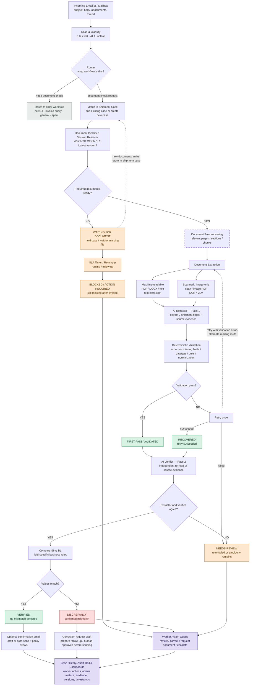

# SDOC

*Shipping Document Verification*

*Refined Product, Architecture, Reliability & Deployment Proposal*

*Hackathon working proposal  |  20 September 2026*

> **Core principle**
>
> AI understands messy email and document semantics. Independent verification and deterministic rules validate the result. Humans handle only unresolved evidence, confirmed discrepancies, or missing prerequisites.

*Basis: organizer Shipping Document Verification use-case brief + refined design decisions from product and reliability review.*

## 1. Executive Summary

SDOC turns the organizer’s SI-to-draft-BL verification task into a persistent background operations system rather than a one-email-at-a-time tool. The system monitors an inbox or organizer dataset, classifies each message, groups related emails and documents into a shipment case, resolves document identity and versions, extracts the seven required fields, cross-checks the extraction independently, and then performs deterministic SI vs. BL comparison.

Routine cases can be cleared automatically. Confirmed mismatches, uncertain extractions, missing documents, and timed-out cases are routed to a worker action queue with source evidence and a complete audit trail. The employee works primarily from a dashboard; the mailbox remains the source, not the main user interface.

> **Key product shift**
>
> The MVP no longer depends on a Chrome extension. SDOC is designed as a backend-first verification platform with worker and admin dashboards, persistent case state, and optional Gmail/Outlook connectivity.

### 1.1 What remains from the organizer brief

- Classify inbox messages, including document-comparison requests, new SI requests, invoice queries, general messages, and spam.
- For comparison requests, read the SI and draft BL and compare seven fields: shipper, consignee, notify party, port of loading, port of discharge, container count, and gross weight in kilograms.
- Show mismatched SI and BL values side by side.
- Escalate when the task cannot be completed reliably rather than guessing or failing silently.
- Support harder inputs such as PDF/Word files, tables, scans, image-only PDFs, varied labels, misleading subjects, missing attachments, and visible processing failures.

### 1.2 What SDOC adds for a deployable workflow

- Background inbox processing and case persistence instead of requiring staff to open each email.
- Shipment-case grouping across multiple emails and days.
- Document identity and version resolution before extraction.
- Relevant-section retrieval for large or multi-page documents.
- Source-traceable extraction plus an independent AI verification pass.
- Timeout/reminder handling for incomplete document sets.
- Worker action queue, admin analytics, audit history, and optional response drafting.
- A Supabase-backed persistent data layer for cases, documents, evidence, review actions, and audit events.

## 2. Product Scope & Design Decisions

| Decision | Refined approach |
| --- | --- |
| Primary operational UI | Worker dashboard for discrepancies, review, blocked cases, and missing-document actions. |
| Management UI | Admin dashboard for volume, automation, SLA, quality, review trends, and audit. |
| Inbox integration | Organizer JSON is the mandatory baseline. Gmail/Outlook API connection is an optional deployment/demo adapter. |
| Chrome extension | Removed from MVP. It may return later as a convenience layer, not as the processing engine. |
| Processing model | Persistent backend processing; browser state is not required for 24/7 analysis. |
| Core unit of work | Shipment case, not a single isolated email. |
| AI strategy | One fixed validated model for MVP; dual independent passes. Production can support a small set of benchmarked approved models. |
| External actions | Verified cases may auto-close. Correction emails are drafted; sending remains policy-controlled / human-approved by default. |

## 3. Refined High-Level Workflow

The architecture separates ingestion, case management, document understanding, independent verification, business comparison, and human action. Persistent state lives in the backend/database, so waiting cases and background processing do not depend on a browser tab remaining open.

**Figure 1. Refined SDOC end-to-end workflow.**

Solid boxes are implemented. The dashed box (Document
Pre-processing) is designed but not built: see
`SDOC_v2_Plan_Addons.md` A1, which replaces relevant-section
retrieval with full-page coverage behind a resource gate.

## 4. Inbox Intake, Router & Shipment Case Management

### 4.1 Scan & classify

SDOC should not send every email directly to an LLM. A cheap deterministic pre-filter first uses known senders, obvious document names, attachment types, thread/case identifiers, and simple rules. Ambiguous messages are then classified by AI using subject, body, attachments, and thread context.

Uncertain messages are never discarded by deterministic rules. They are routed to AI classification so vague or misleading subjects can still reach the correct workflow.

### 4.2 Router

The router decides which workflow should receive the message. The hackathon only needs to fully automate SI-vs-BL comparison; other categories can be classified and routed without implementing their complete downstream workflows.

| Category | Route |
| --- | --- |
| SI / draft BL comparison | Continue to shipment-case verification flow. |
| New SI request | Classify and route to the appropriate operational queue. |
| Invoice query | Classify and route to invoice/support workflow. |
| General operational message | Route to appropriate team/queue. |
| Spam / irrelevant | Filter or ignore according to policy. |

### 4.3 Shipment case

A client can have many shipments; therefore SDOC groups information by shipment rather than by client alone. One shipment case may accumulate several emails, SI, draft BL versions, later corrections, and future document types.

> **Case model**
>
> Client → Shipment Case → Emails + Documents + Versions + Extracted Fields + Evidence + Comparisons + Human Decisions + Audit History

### 4.4 Waiting, reminders & timeout

An incomplete case must never sit silently forever. If the required SI or BL is not yet available, SDOC stores the case as WAITING FOR DOCUMENT, starts a configurable timer, and surfaces reminders or follow-up actions. If the prerequisite remains missing beyond policy/SLA, the case becomes BLOCKED / ACTION REQUIRED and appears in the worker queue. New documents can reopen the case and resume processing automatically.

### 4.5 Concurrency & duplicate prevention

In production, incoming emails may arrive simultaneously. Case creation should therefore be idempotent and use stable shipment identifiers where available, database uniqueness constraints, and atomic find-or-create logic so concurrent messages do not create duplicate shipment cases.

## 5. Document Identity, Version Resolution & Pre-processing

### 5.1 Document Identity & Version Resolver

Before extraction, the system resolves which attachment is the SI, which is the draft BL, which BL version is active, whether the email references an attachment from an earlier thread, and whether all documents belong to the same shipment. If this cannot be decided reliably, SDOC routes the case to human review instead of selecting a file arbitrarily.

| Question | Expected behavior |
| --- | --- |
| Which file is the SI? | Use filename, document content, email context, and thread/case history. |
| Which file is the draft BL? | Identify document role from content, not filename alone. |
| Which BL version is active? | Use explicit revision/version cues and thread chronology; preserve all versions. |
| Does this BL belong to this SI? | Match shipment identifiers and contextual fields; ambiguous pairing → review. |
| Is a required document missing? | WAITING / BLOCKED, never infer the missing document. |

### 5.2 Large-document pre-processing

Raw multi-page documents should not be dumped wholesale into the semantic parser. SDOC first identifies relevant pages, sections, tables, or chunks and passes the most relevant evidence forward. This reduces token usage and lowers the risk that required fields are lost in long context.

## 6. Adaptive Document Extraction & Source Evidence

### 6.1 Machine-readable path

- Recover text and useful structure with PyMuPDF, MarkItDown, or native readers.
- Preserve page, text block, line, and bounding-box information where available.
- Send relevant content to the semantic extractor rather than asking deterministic code to understand arbitrary layouts.

### 6.2 Scanned / image-only path

- Use OCR or a vision-capable model to transcribe/read the page.
- Keep page/region coordinates from OCR/VLM where possible.
- Pass the recovered evidence to the same canonical semantic-extraction step.

### 6.3 Source-Traceable Verification

Every extracted field should carry the best available source evidence. Exact word-level boxes are ideal but not required for every document type. The common requirement is that a reviewer can see where the value came from.

| Evidence level | Use | Reviewer experience |
| --- | --- | --- |
| Exact visual evidence | Machine-readable text coordinates or OCR word boxes. | Highlight the exact value on the source page. |
| Approximate visual evidence | Only block/line/region coordinates are reliable. | Highlight the relevant row/region and show the extracted snippet. |
| Text evidence | Coordinates unavailable or unreliable. | Show document, page if known, and source snippet; open source page manually. |

> **Important limitation**
>
> Source evidence makes extraction traceable, but evidence generated from the same read is not enough to prove factual correctness. A valid-looking OCR/VLM mistake can still pass schema validation; SDOC therefore adds an independent verification pass.

## 7. Dual-Pass AI Verification & Deterministic Guardrails

### 7.1 Pass 1 — Extractor

The primary extractor returns the seven canonical shipment fields together with source evidence. For the MVP, SDOC uses one fixed model and records the exact model/version in the audit trail.

| Canonical field | Type / normalization |
| --- | --- |
| shipper | Text / legal-entity-sensitive comparison |
| consignee | Text / legal-entity-sensitive comparison |
| notify_party | Text / legal-entity-sensitive comparison |
| port_of_loading | Canonical port name/code where reliable |
| port_of_discharge | Canonical port name/code where reliable |
| container_count | Integer |
| gross_weight_kg | Numeric; recognized unit converted deterministically to kg |

### 7.2 Deterministic validation

The validator checks structure, not truth. It verifies required fields, datatype, numeric parseability, recognized units, unit conversion, schema integrity, and canonical normalization. It does not claim that a perfectly formatted OCR value is necessarily the correct value from the document.

### 7.3 Validation status — not model confidence

| Status | Meaning | Action |
| --- | --- | --- |
| FIRST-PASS VALIDATED | Initial extraction satisfies deterministic guardrails. | Continue to independent verification. |
| RECOVERED | Initial attempt failed; one targeted retry succeeded. | Continue, but retain retry trace. |
| NEEDS REVIEW | Retry failed, verifier disagrees, or ambiguity remains. | Human resolves; no silent automated decision. |

These labels intentionally replace HIGH / MEDIUM confidence. They describe process state rather than claiming a calibrated probability of factual correctness.

### 7.4 Targeted retry

There is at most one recovery cycle. If structured parsing fails, SDOC feeds the specific validation error back into the parser. If the reading/transcription path is the problem, SDOC uses one alternate reading route and parses again. Re-running the exact same static output without feedback is not considered a retry.

### 7.5 Pass 2 — Independent verifier

Every valid extraction is independently re-read before business comparison. For the MVP, Pass 2 may use the same model but with an independent prompt/context and without being shown Pass 1’s answer. It reads the original source evidence again and extracts the field independently.

If Pass 1 and Pass 2 agree, the field can proceed to business comparison. If they disagree or the evidence is unclear, the case becomes NEEDS REVIEW. In production, SDOC can benchmark and approve multiple models/providers and use model diversity for stronger cross-checking.

> **Reliability principle**
>
> AI proposes → independent AI re-reads → deterministic rules compare → human resolves disagreement.

## 8. Deterministic SI vs. BL Comparison

After extraction has passed both validation and independent verification, SDOC performs field-specific comparison. A generic string-equality or unrestricted fuzzy-match rule is not sufficient for shipping documents.

| Field | Comparison approach |
| --- | --- |
| Shipper | Normalize case/spacing/punctuation; ambiguous legal-entity similarity → review. |
| Consignee | Conservative entity comparison; do not merge different legal entities without trusted master data. |
| Notify Party | Same conservative entity treatment as consignee. |
| Port of Loading | Normalize reliable port names/codes; ambiguous mapping → review. |
| Port of Discharge | Normalize reliable port names/codes; ambiguous mapping → review. |
| Container Count | Numeric equality after parsing. |
| Gross Weight | Convert recognized units to kg, then compare numeric values. |

### 8.1 Result states

| State | When it occurs | Operational meaning |
| --- | --- | --- |
| VERIFIED | All seven validated/verified fields match. | Routine case can auto-close; optional confirmation according to policy. |
| DISCREPANCY | A verified SI value and verified BL value genuinely differ. | Create worker action + correction-request draft. |
| NEEDS REVIEW | Extraction/verifier disagreement or unresolved ambiguity. | Human checks evidence/corrects extraction. |
| WAITING | Required document not yet available. | Persistent hold with timer/reminder. |
| BLOCKED | Missing/unreadable prerequisite remains unresolved after policy/SLA. | Worker action required before processing can continue. |

## 9. Human Review & Action Workflow

Human review is an action workflow, not only a warning status. The worker dashboard should let employees finish unresolved cases without returning to the raw inbox unless they need additional context.

- Confirm Discrepancy — confirm that verified SI and BL evidence genuinely differ.
- Correct Extraction — replace a wrong extracted value, record before/after evidence, and re-run comparison.
- Request Missing Document — identify the missing prerequisite and prepare/follow up on the request.
- Select Correct Version / Pairing — resolve ambiguous SI/BL pairing or revised BL selection.
- Escalate — send complex cases to a reviewer/team lead with source evidence and reason code.
External communication should remain policy-controlled. Clean cases may optionally send a standard confirmation automatically. Discrepancy cases should prepare a correction-request draft; a human approves before sending by default.

## 10. Persistent Data Layer — Supabase

Supabase is a suitable MVP data layer because it provides PostgreSQL, authentication, file storage, row-level security, realtime updates, and generated APIs. The AI/OCR pipeline runs in the backend and writes results to Supabase; Supabase is not used as the heavy processing engine.

| Core table | Purpose |
| --- | --- |
| organizations | Tenant/client account and policy settings. |
| users | Worker / Reviewer / Admin roles. |
| shipment_cases | Persistent unit of work and case state. |
| emails | Incoming message metadata, thread, sender, timestamps. |
| documents | Attachments and document role. |
| document_versions | Revision lineage such as BL V1/V2/V3. |
| extracted_fields | Canonical values, model/version, validation state. |
| source_evidence | Page, snippet, coordinates/region, evidence type. |
| comparisons | SI vs. BL field-level result and normalized values. |
| review_tasks | Needs-review / discrepancy / blocked action queue. |
| audit_logs | Every automated and human decision with timestamps. |

### 10.1 Data and action safety

- Tenant isolation and role-based access.
- Least-privilege mailbox access and explicit document-retention policy.
- Idempotent ingestion and unique constraints for duplicate prevention.
- Email/document content is treated as untrusted data; it cannot override workflow rules or trigger unauthorized sending/approval.
- Model output is constrained to the expected schema and all model/version identifiers are logged.

## 11. Worker Dashboard & Admin Dashboard

### 11.1 Worker Dashboard

The worker dashboard is for day-to-day action. Its default view should emphasize exceptions rather than already-cleared cases.

- Discrepancies requiring correction/follow-up.
- Needs Review cases with side-by-side source evidence.
- Waiting / Blocked cases and missing-document reminders.
- Correct Extraction / Confirm / Request Document / Escalate actions.
- Case timeline, document versions, and retry/verification history.

### 11.2 Admin Dashboard

The admin dashboard is for team leads and operations management. It should expose both operational health and measurable impact without inventing financial savings.

| Metric family | Examples |
| --- | --- |
| Quality | Discrepancy precision/recall, missed discrepancies, false alarms, correction rate. |
| Productivity | Cases/hour, average processing time, automated resolution rate, manual review rate. |
| Cost / effort | Manual minutes saved, estimated staff hours saved, cost per case if actual assumptions are available. |
| SLA | Turnaround time, % within SLA, overdue/waiting cases, review age. |
| Reliability | First-pass validation rate, recovery rate, verifier disagreement rate, blocked rate. |
| Operations | Processed emails, comparison cases, common discrepancy fields, review backlog. |

> **Business impact framing**
>
> For this challenge, the value story is not “how SDOC becomes a startup.” It is “why Averis should deploy it”: higher quality, more throughput, lower manual effort/cost, stronger SLA performance, and capacity to handle more client volume without proportional headcount growth.

## 12. Validation Strategy

### 12.1 Organizer dataset remains the baseline

The complete organizer JSON inbox and attachment bundle must continue to run directly through the same backend used by the product. This is the non-negotiable benchmark and protects the team from over-investing in UI while core accuracy remains weak.

- Email-category accuracy.
- Field extraction accuracy by field and document type.
- Discrepancy precision and recall.
- Organizer self-evaluation output compatibility.
- Regression testing after every pipeline change.

### 12.2 Advanced derived validation set

| Scenario | What it proves |
| --- | --- |
| Machine-readable PDF / DOCX / tables | Structured extraction and evidence mapping. |
| Scanned / image-only PDF | OCR/VLM route and independent verification. |
| 18.5 MT vs 18,500 KG | Semantic extraction + deterministic unit normalization. |
| Vague/misleading subject | Inbox understanding beyond keyword-only routing. |
| Missing SI or BL | WAITING / BLOCKED behavior; no hallucinated document. |
| Draft BL V1 and V2 | Document identity and version resolution. |
| Extractor misreads a valid-looking value | Verifier disagreement → human correction → re-comparison. |
| Large multi-page document | Relevant-section retrieval / chunking before semantic parsing. |

### 12.3 Metrics worth reporting

- Classification accuracy.
- Per-field extraction accuracy.
- Verifier agreement / disagreement rate.
- Discrepancy precision and recall.
- First-pass validation and recovery rate.
- Human-review routing accuracy / false escalation rate.
- Average processing latency and review time.
- Automated resolution rate and estimated manual time saved using explicit measured assumptions.

## 13. Live Demo Plan

The demo should show reliability and operational flow, not a long feature list. The complete organizer dataset is validated in the backend; the live demo uses a small number of representative shipment cases.

| Demo | Expected result | Capability shown |
| --- | --- | --- |
| Clean SI vs. BL | VERIFIED | Background path + source evidence + dual-pass agreement. |
| 18.5 MT vs 18,500 KG | VERIFIED | Normalization avoids false discrepancy. |
| Container count mismatch | DISCREPANCY | Confirmed mismatch and correction-request draft. |
| Misleading subject | Correctly routed | AI classification when rules are insufficient. |
| Missing BL | WAITING → reminder / BLOCKED | Safe persistent hold; no silent loss. |
| Revised BL V1/V2 | Correct version or review | Document identity/version resolver. |
| Intentional extraction error | NEEDS REVIEW → correct extraction | Verifier catches disagreement; human correction re-runs comparison. |

## 14. Adoption & Deployment Direction

For the hackathon, SDOC can be demonstrated through the organizer dataset and an optional mailbox connection. Real enterprise deployment may require company IT approval, security review, data-retention decisions, and mailbox permissions; these are deployment constraints rather than reasons to complicate the MVP.

### 14.1 Low-friction rollout

1. Connect an existing mailbox; no mailbox migration is required.
1. Run in shadow mode first: SDOC analyzes but does not send or close cases automatically.
1. Compare SDOC decisions with staff decisions and validate accuracy/ROI.
1. Enable automatic resolution gradually for verified cases.
1. Keep external sending configurable; correction requests remain human-approved by default.

### 14.2 Model governance

The MVP uses one fixed model so the complete pipeline can be benchmarked as a system. Before production, SDOC can test multiple candidate models and approve only those that meet reliability thresholds. Customers may choose among approved models or use their own API credentials for an approved model; arbitrary unvalidated models should not be allowed for the core verification path.

SDOC’s value is therefore the verified workflow, evidence, validation, case management, audit, and human-recovery layer — not resale of raw AI tokens.

## 15. Recommended Build Priorities

| Priority | Feature / deliverable | Reason |
| --- | --- | --- |
| P0 | Organizer dataset adapter + regression evaluation | Core competition requirement and measurement baseline. |
| P0 | Email classification + router | Core requirement; feeds every downstream workflow. |
| P0 | Shipment case + document identity/version resolver | Prevents isolated-email logic and wrong document pairing. |
| P0 | Machine-readable + scan extraction | Core advanced document understanding. |
| P0 | Source evidence + canonical seven-field schema | Traceability and reliable review. |
| P0 | Deterministic validation + one targeted retry | Bounded recovery; no endless loops. |
| P0 | Independent verifier + agreement gate | Reduces valid-looking extraction errors. |
| P0 | Field-specific SI/BL comparison | Avoids false mismatches from formatting/unit differences. |
| P1 | Worker dashboard + human actions | Completes unresolved-case workflow. |
| P1 | Waiting timer/reminders + blocked queue | Prevents incomplete cases from disappearing. |
| P1 | Admin dashboard + impact metrics | Operational visibility and deployment value. |
| P1 | Correction-request / confirmation drafting | Operational convenience after core reliability works. |
| P2 | Gmail/Outlook live adapters | Real deployment path after core is stable. |
| P2 | Advanced auth, private deployment, multi-model routing | Enterprise hardening beyond hackathon MVP. |

## 16. Final Design Principles

| Principle | Meaning |
| --- | --- |
| Background first | The backend processes the inbox continuously; the UI is for action, not for triggering each check. |
| Shipment case is the unit | Emails and document versions accumulate around one shipment over time. |
| AI understands; rules verify | AI handles language/layout semantics; deterministic logic handles structure, normalization, and equality. |
| Independent verification | A second read cross-checks extraction before business comparison. |
| Evidence is traceable | Every field links back to the best available source evidence. |
| Retry is bounded | One targeted recovery cycle with explicit feedback/alternate reading path. |
| No false confidence | Use process statuses FIRST-PASS VALIDATED / RECOVERED / NEEDS REVIEW, not uncalibrated confidence percentages. |
| Humans resolve exceptions | Humans correct ambiguity, missing prerequisites, and external discrepancy actions; routine clean cases can auto-clear. |
| Waiting is active state | Timers, reminders, and escalation prevent cases from sitting silently forever. |
| Measure Averis impact | Quality, productivity, cost/effort, SLA, and capacity are more relevant than a startup-style business model. |

> **Positioning**
>
> SDOC is a reliable shipping-document operations platform: it organizes shipment cases, verifies source evidence, automatically clears routine work, and sends only genuine exceptions to people.
