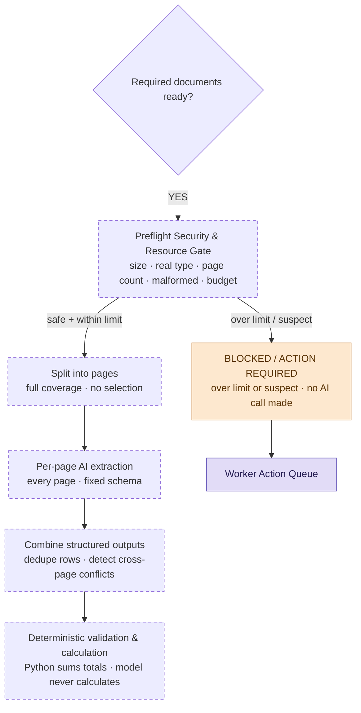

# SDOC v2 Plan — Add-ons

Amendments to `SDOC_Refined_Proposal_v2.md`, 20 September 2026.

This document records design decisions taken after v2 was written. Where an
add-on supersedes a v2 section, that is stated explicitly. Everything else in
v2 stands unchanged.

## How to read this

Each add-on is keyed to the v2 section it amends, and carries a status:

| Status | Meaning |
|---|---|
| **Built** | Implemented and covered by the regression suite. |
| **Designed** | Specified here, not yet implemented. |
| **Deferred** | Deliberately out of scope for the MVP; a deployment requirement. |

The distinction is load-bearing. v2's architecture diagram describes the target
system, not the current one; this document is where the difference is recorded.

---

## A1. Coverage model — full coverage replaces page ranking

**Amends §5.2 (Large-document pre-processing). Status: Designed.**

v2 §5.2 specifies identifying "relevant pages, sections, tables, or chunks" and
passing the most relevant evidence forward. That is superseded.

**Rule: page ranking must never be the coverage mechanism for a field where
missing one page could change the answer.**

The reasoning: a heuristic selector that drops a page produces a value that
parses cleanly, passes schema validation, and is wrong — the exact failure mode
v2 Table 8 warns about. Correctness cannot be bolted onto a selector after the
fact.

The revised model:

```
Document
   ↓
Read EVERY page
   ↓
Split into per-page chunks
   ↓
AI extracts fields/rows from EVERY chunk
   ↓
Combine structured outputs
   ↓
Deterministic validation + calculation
```

Applied by document size:

| Document | Handling |
|---|---|
| Small / normal | Process every page. No selection logic at all. |
| Large | Process every page, in parallel chunks. |
| Over the configured page budget | Do not process. Route to review (see A3). |

A 500-page PDF is never dumped into one prompt — context limits and
middle-of-context recall loss both apply. It is processed page by page, or
refused. It is never sampled.

Ranking is removed entirely rather than repurposed: per-page extraction already
records which page produced each value, so that output *is* the navigation
index. A second scoring mechanism could only disagree with it.

**Vector search / RAG is explicitly not used for this.** By the time
pre-processing runs, the Document Identity & Version Resolver has already
determined which file is the SI and which is the draft BL, so there is no
corpus to retrieve from — only a known document to read completely. Semantic
retrieval would add a nondeterministic component upstream of extraction,
weaken evidence traceability, and reintroduce the silent-miss failure mode.
RAG remains appropriate for a future cross-case search feature, which is a
different problem.

## A2. Aggregate fields — the model never calculates

**Amends §7 (Dual-Pass AI Verification). Status: Designed.**

`container_count` and `gross_weight_kg` are aggregates and are handled
differently from the five point-lookup fields.

They may be stated once in a header, stated as a total at the end of a
multi-page table, or **not stated at all** and derivable only by summing line
items. In the third case no page subset can produce a correct answer.

```
1. scan ALL pages locally             (PyMuPDF, no API cost)
2. AI reads structure                 -> "col 4 = gross weight per container"
3. code extracts every row and sums it
4. stated total also present?
       agrees    -> proceed
       disagrees -> NEEDS REVIEW, both values shown with page numbers
5. any page that failed to parse
       -> aggregate is UNVERIFIABLE, never a partial sum
```

This follows the existing principle *AI understands; rules verify*. Arithmetic
is a rules job. The model identifies table structure; Python performs the
summation.

Step 5 is the critical one: a partial sum is worse than no answer, because it
is indistinguishable from a correct one.

### Merge rules

Combining per-page outputs is where the remaining risk sits:

| Case | Rule |
|---|---|
| A page failed to extract | Aggregate is unverifiable. Never sum the rest. |
| Rows span a page boundary | Deduplicate by container number where present; flag where absent. Silent double-counting corrupts a total. |
| Same field, different values on different pages | Document contradicts itself → `NEEDS REVIEW` with both values and both page numbers. Not first-wins. |

## A3. Preflight Security & Resource Gate

**New section, inserted before §5 (Document Identity). Status: Built.**

Full-page coverage creates a cost-amplification surface: an untrusted sender
controls the input, and the input controls AI spend. A 500-page junk PDF must
not translate into 500 model calls.

**The claim v2 should make is not "SDOC reads every page." It is:**

> For accepted documents, SDOC provides full-page coverage. Documents first
> pass security and resource controls before AI processing begins.

This is stronger because it states the guarantee *and* its precondition.

```
Incoming email
   ↓
1. Sender / spam screening
   ↓
2. Attachment pre-check   (real file type, size, page count, malformed, encrypted)
   ↓
3. Resource limit check
   ↓
SAFE + WITHIN LIMIT  -> process every page
OVER LIMIT / SUSPECT -> no AI call; BLOCKED + review task
```

### Gate ordering is the gate

Checks run strictly in increasing cost, because **parsing is itself the attack
surface** — counting pages requires opening the document:

1. byte length — free, no parse
2. magic bytes — free, first few bytes
3. *only now is parsing permitted*
4. page count and archive expansion

A gate that opens a hostile PDF to measure it is not a cheap gate.

**Implemented as far as step 4.** Parsing runs in-process, not in a sandboxed
child with a wall-clock timeout — that belongs with the deferred isolation
control below. So the ordering reduces how often hostile bytes reach a parser;
it does not contain a parser that misbehaves once they do.

### Controls

| Control | Status | Note |
|---|---|---|
| Filename sanitization on write | **Built** | Fixed a live path-traversal defect. |
| Real file-type verification (magic bytes) | **Built** | The extension is not trusted. |
| Max size / page count / attachment count | **Built** | Configurable by environment; over-limit → `BLOCKED`. |
| Encrypted or corrupt → `BLOCKED`, no retry | **Built** | No loop on unreadable input. |
| OOXML expansion limits | **Built** | `.docx` and `.xlsx` **are** zip archives — the bomb vector is in the accepted types, not a hypothetical `.zip`. Covers entity expansion, not just decompressed size. |
| Per-case AI budget | **Partly built** | Bounded by the gate's size, page and attachment caps; a token-level budget is not implemented. |
| Per-sender rate limit + global daily ceiling | **Built** | Daily ceilings persist across restarts, so a restart does not reset an attacker's allowance. |
| Queue and concurrency limits | Designed | One sender cannot occupy every worker. Not implemented. |
| Malware scanning | **Deferred** | ClamAV directly. Genuinely important in production — logistics is a heavily phished sector — but not an MVP item per §14. |
| Isolated container parsing, no egress | **Deferred** | Deployment requirement. Parsing currently runs in-process, so the gate reduces exposure rather than containing it. |
| Per-organization configurable policy | **Deferred** | Follows tenancy work. |

### Normal and large-document lanes

```
Normal lane   ≤ limit  -> process all pages automatically
Large lane    > limit  -> metadata scan only
                       -> human approval or trusted-sender policy
                       -> then process with a larger budget
```

A genuine 300-page manifest remains supportable; a spam sender cannot force
spend. **This requires no new case states** — `BLOCKED` already means
"unresolved prerequisite, human action required," which describes an
over-limit document exactly, and the review-task queue already exists.

### Prompt injection

Document text is data and carries no authority. Two controls, in order of
strength:

1. **Mailbox scope is `gmail.readonly`.** SDOC cannot send mail or modify the
   mailbox whatever a document instructs. This is structural, not a runtime
   check, and it defeats the worst outcome outright.
2. **Model output is schema-constrained.** Note this bounds *structure*, not
   *content* — a `shipper` field can still contain arbitrary attacker text.
   The operative control is therefore bounding and escaping extracted values
   where they are rendered, plus correction drafts remaining human-approved.

## A4. Page-level provenance

**Strengthens §6.3 (Source-Traceable Verification). Status: Built.**

Per-page extraction yields the page number for every field as a by-product.
That satisfies v2 Table 7's "text evidence" tier — document, page, snippet —
at no additional cost, and is the minimum the review workflow requires.

Where the reader can supply block coordinates, the higher "approximate visual
evidence" tier follows without further model work.

This also sharpens Pass 2: page-scoped independent reads identify *which page*
the two passes diverged on, not merely that they disagreed.

## A5. Spam filtering — position and scope

**Amends §4.1 (Scan & classify). Status: Built (provider signal) / Deferred (gateway filtering).**

SDOC's classifier answers *"which of five business workflows does this belong
to"*, not *"is this unsolicited bulk mail"*. Four of the five categories
concern operational routing; spam is one bucket.

Gateway-level spam filtering (rspamd or equivalent) is **out of SDOC's
boundary**:

- §14.1 commits to connecting an existing mailbox, so SDOC does not own mail
  transport.
- On a Gmail deployment the provider has already filtered, and its verdict is
  consumed directly as the classifier's highest-priority rule.
- An MTA filter's strongest signals — connecting-IP reputation, greylisting,
  envelope rate limiting — do not survive post-delivery API access. It would
  run disarmed.

For customers running their own mail infrastructure, such a filter is a
legitimate upstream control owned by their IT function. SDOC assumes it, and
does not ship it.

Where the security gate *does* assist classification: a declared file type
that disagrees with the actual type is a strong malicious-mail signal, and is
computed by the gate anyway. It should be passed to the classifier as an input.

## A6. Truncation must be loud

**Amends §7.2 (Deterministic validation). Status: Built.**

Silent truncation of document text is prohibited. If content is cut before
extraction, the affected fields are reported as unverifiable rather than
missing — a field that is absent and a field that was never read must not be
indistinguishable.

Per-page processing (A1) removes the need for truncation on the main path.

## A7. Implementation status against v2

Recorded so the architecture diagram is not mistaken for the running system.

| v2 element | Status |
|---|---|
| Organizer dataset adapter + regression evaluation | Built — 520 emails |
| Email classification + router | Built — all five categories |
| Shipment case + identity/version resolver | Built |
| Machine-readable + scanned extraction | Built |
| Canonical seven-field schema | Built |
| Field-specific SI/BL comparison | Built |
| Independent verifier + agreement gate | Built |
| Waiting timers, blocked queue | Built |
| Worker dashboard, admin dashboard | Built |
| Correction / confirmation drafting | Built |
| Gmail live adapter | Built — P2 item, delivered early |
| Source evidence | Built — page, box and snippet from PDFs; line and page from text and OCR |
| **Document pre-processing / full-page coverage** | **Not built** — superseded by A1; the current path reads whole documents |
| Targeted retry with validation feedback | Built — failures are fed back, with OCR as the alternate route |
| `FIRST-PASS VALIDATED` / `RECOVERED` statuses | Built — recorded per document with a retry trace |
| **Correct Extraction** | Built — before/after kept, comparison re-run by the same rules |
| **Select Version / Pairing action** | **Not built** — review resolution for pairing is a note only |
| Preflight security gate | Built — see A3 |
| Authentication, tenancy, RBAC | Deferred — P2 per §15 |

### Resolved defects

The Gmail attachment **write** path built its destination from the MIME
filename without containment, so a traversal filename resolved outside the
attachment root. Fixed by filename sanitization, with the serve path's
existing containment left unchanged.

The Supabase store returned comparisons under `evidence_json` while the worker
dashboard reads `evidence`, so the seven-field table never rendered against
the hosted store. Both stores now return the same shape.

## A8. Demo positioning

Of the two v2 Table 18 rows that could not be demonstrated:

- *"Intentional extraction error → NEEDS REVIEW → correct extraction →
  re-comparison"* — now demonstrable; Correct Extraction is implemented.
- *"Large multi-page document → relevant-section retrieval"* — superseded by
  A1; the honest claim is now full-page coverage behind a resource gate.

The security gate is not allocated demo time. It is defensive and invisible
when working, and v2 §13 prioritises reliability and operational flow over
feature breadth. It should instead be evidenced by the regression suite and
held ready for the question judges reliably ask.

---

## Revised workflow — gate placement

Inserted between document readiness and extraction. Dashed nodes are designed,
not yet built.


